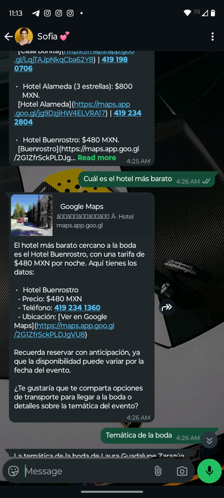
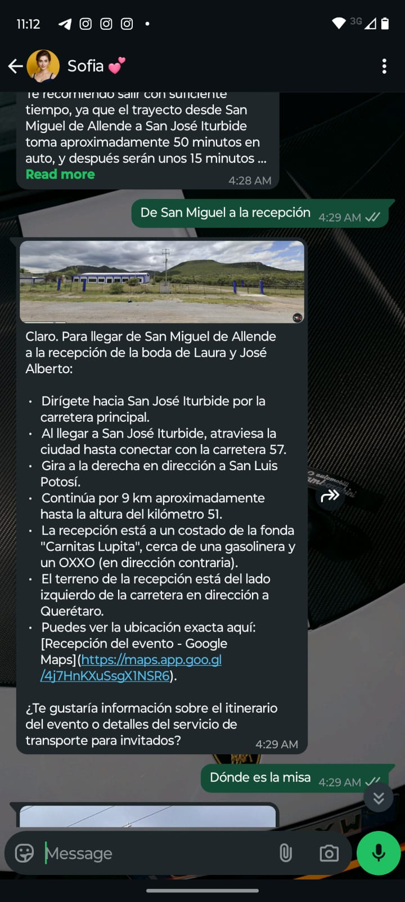
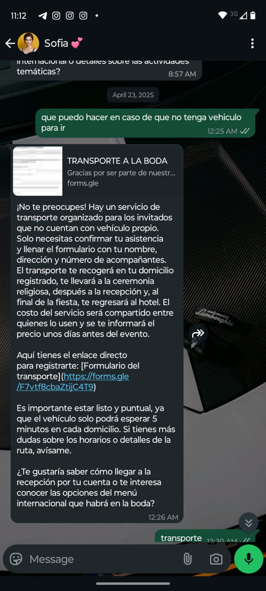
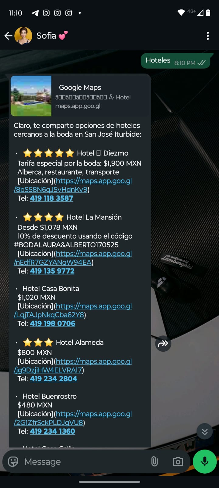
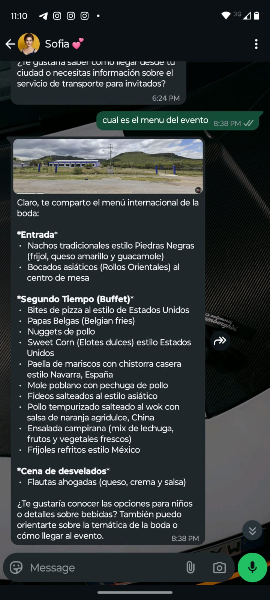
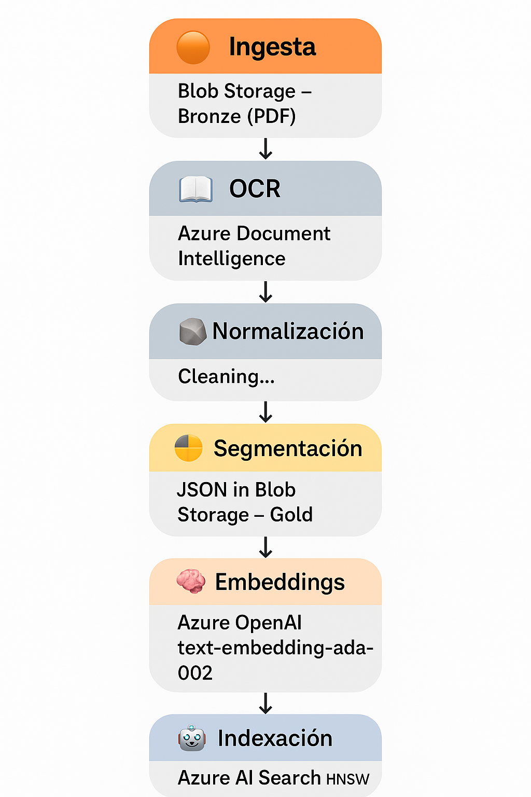

## Sofía – Asistente Conversacional para Bodas

*Sofía* es un asistente conversacional para **WhatsApp**, creado específicamente para preguntas y respuestas para bodas.

- **Backend RAG en Azure**  
  - **GPT-4.1**  
  - Búsqueda híbrida **BM25 + embeddings**  
  - Responde con información verificada (agenda, vestimenta, traslados, menús).

- **Integración con Twilio**  
  - Envía y recibe mensajes.  
  - Transcribe audios con **ElevenLabs**.  
  - Limita sus respuestas a ≈ **1600 caracteres** para mayor claridad y rapidez.

- **Memoria contextual**  
  - Maneja ≈ **1 M tokens**, permitiendo seguimiento de conversaciones largas sin perder datos importantes de cada invitado.

---

---

---

---

---

---

---

---

---

## 🚀 RAG Pipeline «Wedding Info» — Visión General

Este script implementa un **flujo extremo-a-extremo** que transforma un PDF alojado en Azure Blob Storage en documentos indexados con vectores para un asistente conversacional (Sofía) sobre Azure AI Search + Azure OpenAI.

---

## ➡️ **Arquitectura de alto nivel**

**Pasos del flujo**

- 🟠 **Ingesta:** El PDF se almacena en **Blob Storage – Bronze**.

- 📖**OCR:** prebuilt-read de **Azure Document Intelligence** extrae el texto.

- 🪨 **Persistencia Silver:** El texto plano se guarda en **Blob Storage – Silver**.

- 🗄️ **Normalización:** Se limpia y se preservan encabezados relevantes.

- 🟡 **Segmentación:** El texto se estructura jerárquicamente y se escribe como JSON en **Blob Storage – Gold**.

- 🧠 **Embeddings:** Cada título + subtítulo se convierte en vector con **Azure OpenAI** (text-embedding-ada-002) con 1536 tokens de tamaño.

- 🗺️ **Indexación:** Documentos y vectores se cargan en **Azure AI Search** usando un perfil HNSW.

- 🤖 **Consulta híbrida:** Sofía combina búsqueda por palabras **clave + vector** para responder con GPT-4o.

---

## 🌐 **Lista de Endpoints Creados en la API FastAPI Desplegada en Azure**  

Después de organizar y estructurar el código, la API ahora tiene **dos módulos principales**:
- **Módulo `webhook`** → Para manejar la integración con Twilio WhatsApp API.
- **Módulo `chat`** → Para manejar consultas con GPT-4.1 utilizando Azure OpenAI.

Aquí están **todos los endpoints creados** y su respectiva funcionalidad. 🎯🔥  

---

## 🌐 **Resumen de la API FastAPI en Azure**
| **Método** | **Ruta** | **Descripción** |
|-----------|---------|----------------|
| **GET** | `/` | 🏠 **Endpoint principal** que devuelve un mensaje de bienvenida. |
| **POST** | `/chat` | 💬 **Realiza consultas a GPT-4.1** y recibe respuestas basadas en Retrieval-Augmented Generation (RAG). |
| **POST** | `/webhook` | 📥 **Recibe mensajes entrantes de WhatsApp** y los procesa en FastAPI. |

## Mejoras en producción

- Se migro el modelo de un GPT-4o (128k tokens) a un GPT 4.1 (1M tokens).
- Se implemento un workflow para enviar los cambios del pdf por correo para luego ser ingestados en Bronze.

## Proximas mejoras

- Incorppración de memoria para persistencia de mensajes por usuario.
- Implementar un DAG para RAG pipeline para automatizar el workflow de datos.

 

