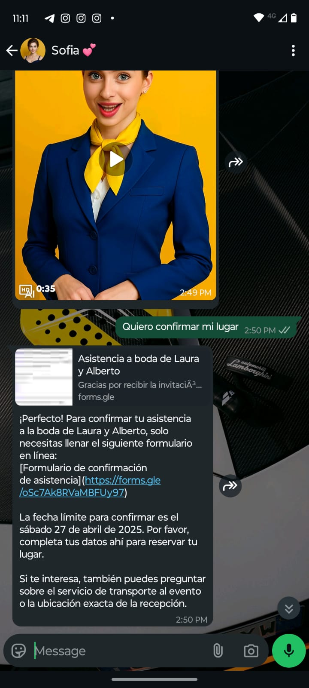

## Sofía – Wedding Conversational Assistant

*Sofía* is a conversational assistant for **WhatsApp**, specifically designed for wedding-related questions and answers.

- **RAG Backend on Azure**  
  - **GPT-4.1**  
  - **BM25 + embeddings** hybrid search  
  - Provides verified information (schedule, dress code, transportation, menus).

- **Twilio Integration**  
  - Sends and receives messages.  
  - Transcribes audio with **ElevenLabs**.  
  - Limits responses to ≈ **1600 characters** for clarity and speed.

- **Contextual Memory**  
  - Handles ≈ **1M tokens**, allowing for tracking of long conversations without losing important guest information.

---

---

---

---

---

---

---

---

---

## RAG Pipeline «Wedding Info» — Overview

This script implements an **end-to-end flow** that transforms a PDF hosted in Azure Blob Storage into indexed documents with vectors for a conversational assistant (Sofía) on Azure AI Search + Azure OpenAI.

---

## High-Level Architecture

**Flow Steps**

- Ingestion: The PDF is stored in **Blob Storage – Bronze**.

- OCR: Prebuilt-read of **Azure Document Intelligence** extracts the text.

- Persistence Silver: The plain text is saved in **Blob Storage – Silver**.

- Normalization: The text is cleaned and relevant headers are preserved.

- Segmentation: The text is structured hierarchically and written as JSON in **Blob Storage – Gold**.

- Embeddings: Each title + subtitle is converted into a vector with **Azure OpenAI** (text-embedding-ada-002) with 1536 tokens in size.

- Indexing: Documents and vectors are loaded into **Azure AI Search** using an HNSW profile.

- Hybrid Query: Sofía combines keyword + vector search to respond with GPT-4.

---

## List of Endpoints Created in the FastAPI API Deployed in Azure

After organizing and structuring the code, the API now has **two main modules**:
- **Webhook module** → For handling Twilio WhatsApp API integration.
- **Chat module** → For handling GPT-4.1 queries using Azure OpenAI.

Here are **all the endpoints created** and their respective functionality.

---

## Summary of the FastAPI API in Azure
| **Method** | **Route** | **Description** |
|-----------|---------|----------------|
| **GET** | `/` | Home endpoint that returns a welcome message. |
| **POST** | `/chat` | Performs queries to GPT-4.1 and receives responses based on Retrieval-Augmented Generation (RAG). |
| **POST** | `/webhook` | Receives incoming WhatsApp messages and processes them in FastAPI. |

## Production Improvements

- The model was migrated from GPT-4o (128k tokens) to GPT 4.1 (1M tokens).
- A workflow was implemented to send PDF changes by email for later ingestion into Bronze.

## Future Improvements

- Incorporation of memory for message persistence by user.
- Implement a DAG for the RAG pipeline to automate the data workflow.
- To improve the user experience, a digital avatar can be created in the app or a real-time voice can be implemented using Twilio for continuous calls.
- Allocation evaluators.
